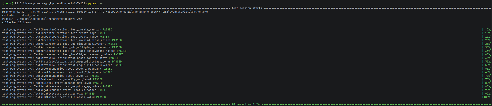

# Лабораторная работа №1 <br> Составление тест-кейсов для готового кода. Качество ПО и место тестирования в жизненном цикле

## Цель работы

Сформировать системное представление о качестве ПО и роли тестирования в жизненном цикле; приобрести практические навыки проектирования тест-кейсов и написания автотестов на основе готового кода.

**Задачи:**

1. Проанализировать готовый модуль и выделить бизнес-правила, входные и выходные данные, ограничения.
2. Составить набор тест-кейсов: позитивных, негативных, граничных, покрывающих эквивалентные классы.
3. Оформить тест-кейсы по стандартным атрибутам.
4. Реализовать автотесты на Python + pytest.
5. Запустить тесты и зафиксировать результаты.
6. Сделать вывод о связи тестирования, качества ПО и жизненного цикла.

#### Задание 1: Изучить исходный код и выписать все бизнес-правила.

1. Если `total_xp < 0` — выбрасывается `ValueError`.
2. Если `total_xp` не является `int` — выбрасывается `TypeError`.
3. Если `character_class` не в списке допустимых классов — `ValueError` при создании персонажа.
4. Если достижение неизвестное — `ValueError` при добавлении.
5. Если достижение уже добавлено — `ValueError` (защита от дублирования).
6. Базовая формула опыта для уровня N: `N² × 100`.
7. Класс персонажа умножает получаемый опыт на множитель (warrior: 1.0, mage: 1.2, rogue: 1.5, healer: 1.3).
8. Достижения дают фиксированный бонусный опыт (first_blood: 50, treasure_hunter: 150, boss_slayer: 300, speedrunner: 200).
9. Итоговый эффективный опыт = `total_xp + class_bonus + achievement_bonus`.
10. Уровень рассчитывается по формуле: `floor(sqrt(effective_xp / 100))`.
11. Максимальный уровень ограничен значением 100.

#### Задание 2: Определить: входные параметры, выходной параметр, допустимые и недопустимые значения, граничные значения.

##### Входные параметры:
1. `character_class` — класс персонажа (str): `"warrior"`, `"mage"`, `"rogue"`, `"healer"`.
2. `total_xp` — базовый опыт персонажа (int).
3. `achievements` — список достижений (добавляются через метод `add_achievement`).

##### Выходной параметр:
* Объект `CharacterStats` со следующими полями:
  - `level` — текущий уровень (int)
  - `base_xp` — базовый опыт (int)
  - `class_bonus_xp` — бонус от класса (float)
  - `achievement_bonus_xp` — бонус от достижений (int)
  - `total_effective_xp` — итоговый эффективный опыт (float)
  - `xp_to_next_level` — опыт до следующего уровня (float или None)
  - `is_max_level` — достигнут ли максимальный уровень (bool)

##### Допустимые и недопустимые значения:

**Допустимые значения:** 
1. `character_class`: `"warrior"`, `"mage"`, `"rogue"`, `"healer"`
2. `total_xp`: целое число >= 0
3. Достижения: `"first_blood"`, `"treasure_hunter"`, `"boss_slayer"`, `"speedrunner"` (без дублирования)

**Недопустимые значения:**
1. `total_xp < 0`
2. `total_xp` не является `int` (например, `100.5`)
3. Неизвестный класс (например, `"Владыка паровоза"`)
4. Неизвестное достижение (например, `"fake_achievement"`)
5. Дублирование достижений

##### Граничные значения:
1. `total_xp`: [0] — минимальный опыт (уровень 0)
2. `total_xp`: [99, 100] — граница уровня 1
3. `total_xp`: [399, 400] — граница уровня 2
4. `total_xp`: [1000000] — опыт для максимального уровня 100
5. `total_xp`: [2000000] — опыт превышает максимум
6. Достижения: [] — нет достижений (0 бонусов)
7. Достижения: все 4 достижения — максимальный бонус (750)

#### Задание 3: Составить не менее 10 тест-кейсов.

### Таблица тест-кейсов для модуля расчета уровня персонажа

| ID    | Название тест-кейса                          | Тип        | Входные данные | Ожидаемый результат |
|:------|:---------------------------------------------|:-----------|:---------------|:--------------------|
| TC-01 | Создание воина                               | Позитивный | `RPGCharacter("warrior")` | `multiplier == 1.0` |
| TC-02 | Создание мага                                | Позитивный | `RPGCharacter("mage")` | `multiplier == 1.2` |
| TC-03 | Добавление достижения                        | Позитивный | `add_achievement("first_blood")` | 1 достижение |
| TC-04 | Дублирование достижения                      | Негативный | Добавить `first_blood` дважды | `ValueError` |
| TC-05 | Базовая статистика воина                     | Позитивный | `calculate_stats(100)` | `level == 1` |
| TC-06 | Бонус мага от класса                         | Позитивный | `calculate_stats(100)` для mage | `class_bonus_xp == 20` |
| TC-07 | Граница уровня 1 (99 опыта)                  | Граничный  | `calculate_stats(99)` | `level == 0` |
| TC-08 | Граница уровня 1 (100 опыта)                 | Граничный  | `calculate_stats(100)` | `level == 1` |
| TC-09 | Граница уровня 2 (399 опыта)                 | Граничный  | `calculate_stats(399)` | `level == 1` |
| TC-10 | Граница уровня 2 (400 опыта)                 | Граничный  | `calculate_stats(400)` | `level == 2` |
| TC-11 | Максимальный уровень                         | Граничный  | `calculate_stats(1000000)` | `level == 100` |
| TC-12 | Превышение максимального уровня              | Граничный  | `calculate_stats(2000000)` | `level == 100` |
| TC-13 | Отрицательный опыт                           | Негативный | `calculate_stats(-100)` | `ValueError` |
| TC-14 | Дробный опыт                                 | Негативный | `calculate_stats(100.5)` | `TypeError` |
| TC-15 | Нулевой опыт                                 | Граничный  | `calculate_stats(0)` | `level == 0` |

#### Задание 4: Написать автотесты на `pytest`

Исходный код находится в файле `rpg_system.py`. Автотесты в файле `test_rpg_system.py`.

```python
import pytest
from rpg_system import RPGCharacter, CharacterStats


class TestCharacterCreation:
    def test_create_warrior(self):
        char = RPGCharacter("warrior")
        assert char.character_class == "warrior"
        assert char.multiplier == 1.0
    
    def test_create_mage(self):
        char = RPGCharacter("mage")
        assert char.multiplier == 1.2
    
    def test_create_rogue(self):
        char = RPGCharacter("rogue")
        assert char.multiplier == 1.5
        assert len(char.achievements) == 0
    
    def test_invalid_class_raises(self):
        with pytest.raises(ValueError, match="Unknown class"):
            RPGCharacter("necromancer")


class TestAchievements:
    def test_add_single_achievement(self):
        char = RPGCharacter("warrior")
        char.add_achievement("first_blood")
        assert len(char.achievements) == 1
    
    def test_add_multiple_achievements(self):
        char = RPGCharacter("warrior")
        char.add_achievement("first_blood")
        char.add_achievement("treasure_hunter")
        assert len(char.achievements) == 2
    
    def test_duplicate_achievement_raises(self):
        char = RPGCharacter("warrior")
        char.add_achievement("first_blood")
        
        with pytest.raises(ValueError, match="already added"):
            char.add_achievement("first_blood")
    
    def test_invalid_achievement_raises(self):
        char = RPGCharacter("warrior")
        
        with pytest.raises(ValueError, match="Unknown achievement"):
            char.add_achievement("fake_achievement")


class TestStatsCalculation:
    def test_basic_warrior_stats(self):
        char = RPGCharacter("warrior")
        stats = char.calculate_stats(100)
        
        assert stats.level == 1
        assert stats.base_xp == 100
        assert stats.class_bonus_xp == 0
        assert stats.achievement_bonus_xp == 0
    
    def test_mage_with_class_bonus(self):
        char = RPGCharacter("mage")
        stats = char.calculate_stats(100)
        
        assert stats.class_bonus_xp == 20
        assert stats.total_effective_xp == 120
    
    def test_rogue_with_achievement(self):
        char = RPGCharacter("rogue")
        char.add_achievement("first_blood")
        stats = char.calculate_stats(200)
        
        assert stats.achievement_bonus_xp == 50
        assert stats.total_effective_xp == 350


class TestLevelBoundaries:
    def test_level_1_boundary(self):
        char = RPGCharacter("warrior")
        
        stats_below = char.calculate_stats(99)
        assert stats_below.level == 0
        
        stats_exact = char.calculate_stats(100)
        assert stats_exact.level == 1
    
    def test_level_2_boundary(self):
        char = RPGCharacter("warrior")
        
        stats_below = char.calculate_stats(399)
        assert stats_below.level == 1
        
        stats_exact = char.calculate_stats(400)
        assert stats_exact.level == 2
    
    def test_level_10(self):
        char = RPGCharacter("warrior")
        stats = char.calculate_stats(10000)
        assert stats.level == 10


class TestMaxLevel:
    def test_exactly_max_level(self):
        char = RPGCharacter("warrior")
        stats = char.calculate_stats(1000000)
        
        assert stats.level == 100
        assert stats.is_max_level is True
        assert stats.xp_to_next_level is None
    
    def test_exceeds_max_level(self):
        char = RPGCharacter("warrior")
        stats = char.calculate_stats(2000000)
        
        assert stats.level == 100
        assert stats.is_max_level is True


class TestNegativeCases:
    def test_negative_xp_raises(self):
        char = RPGCharacter("warrior")
        
        with pytest.raises(ValueError, match="total_xp must be >= 0"):
            char.calculate_stats(-100)
    
    def test_float_xp_raises(self):
        char = RPGCharacter("warrior")
        
        with pytest.raises(TypeError, match="must be int"):
            char.calculate_stats(100.5)
    
    def test_zero_xp(self):
        char = RPGCharacter("warrior")
        stats = char.calculate_stats(0)
        
        assert stats.level == 0
        assert stats.total_effective_xp == 0


class TestAllClasses:
    def test_all_classes_valid(self):
        classes = ["warrior", "mage", "rogue", "healer"]
        
        for char_class in classes:
            char = RPGCharacter(char_class)
            stats = char.calculate_stats(1000)
            assert stats.level >= 1
```
#### Задание 5: Запустить тесты командой `pytest -v`:



#### Задание 6: Сделать вывод: какие ветви кода покрыты, какие риски остались, почему тестирование важно для качества.

* Какие ветви кода покрыты?

Покрыты пути валидации входных данных (отрицательный опыт, дробный опыт, неизвестный класс, неизвестное достижение, дублирование достижения), все четыре класса персонажей с их множителями, расчет базовой статистики без бонусов, применение бонусов от достижений, граничные переходы между уровнями (99-100, 399-400), достижение максимального уровня и его превышение.

* Какие риски остались?

Если на вход придет строка вместо числа, код упадет с ошибкой TypeError в методе `_validate_xp`, проверка на тип там есть, но она срабатывает только для float, а не для строк - это может быть неочевидно при интеграции с внешними системами.

Множители классов и бонусы достижений оформленны прямо в классе `RPGCharacter`. Если необходимо изменить баланс или добавить новый класс, придется лезть в код и менять константы, что повышает риск случайно сломать остальную логику.

* Почему тестирование важно для качества?

1. Описание бизнес-логики проекта. Тесты показывают, как система должна себя вести, какие есть ограничения, граничные значения и исключения.
2. Дешевизна исправлений. Чем раньше будет найдена уязвимость - тем дешевле её исправить, не доводя проект на подакшн.
3. Защита от регрессии. Автотесты на каждом этапе позволяют добавлять новый функционал или делать рефакторинг кода не сломав уже работающие сценарии.
4. Снижение рисков для пользователей. Тестирование (особенно негативное и граничное) гарантирует, что система корректно обрабатывает вредоностные входные данные и не допускает сбоев, которые могут испортить пользовательский опыт или привести к потере личных данных.