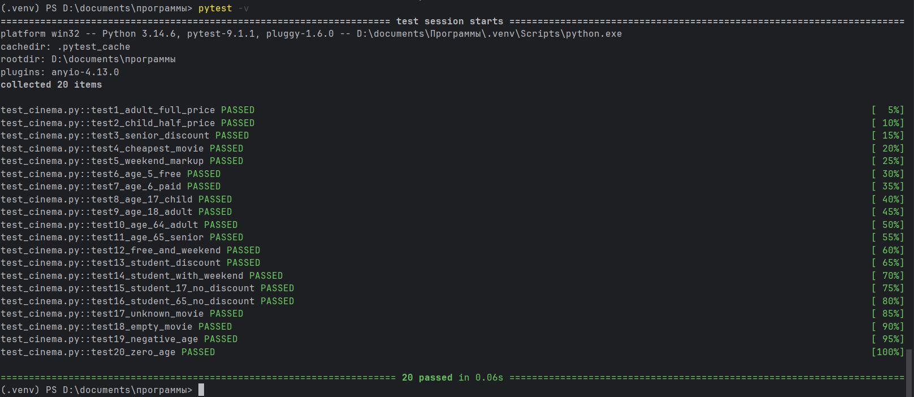

# Лабораторная работа №1   Составление тест-кейсов для готового кода. Качество ПО и место тестирования в жизненном цикле

**Выполнила:** Жаворонкова Дарья  
**Группа:** ВТ-232  

## Цель работы

Сформировать системное представление о качестве ПО и роли тестирования в жизненном цикле; приобрести практические навыки проектирования тест-кейсов и написания автотестов на основе готового кода.

## Задачи:

1. Проанализировать готовый модуль и выделить бизнес-правила, входные и выходные данные, ограничения.
2. Составить набор тест-кейсов: позитивных, негативных, граничных, покрывающих эквивалентные классы.
3. Оформить тест-кейсы по стандартным атрибутам.
4. Реализовать автотесты на Python + pytest.
5. Запустить тесты и зафиксировать результаты.
6. Сделать вывод о связи тестирования, качества ПО и жизненного цикла.

## Выполнение заданий:

## Задание 1. Изучить исходный код и выписать все бизнес-правила.
Все написано в файле `cinema.py`

## Задание 2. Определить:входные параметры, выходной параметр, допустимые и недопустимые значения, граничные значения.

#### Входные параметры:
- movie: str — название фильма из списка `MOVIES`
- age: int — возраст покупателя
- is_student: bool — является ли покупатель студентом
- is_weekend: bool — является ли день выходным

#### Выходной параметр:
- float — итоговая цена билетая

#### Допустимые значения:
- movie — одно из массива: "человек-паук: нет пути домой", "сумерки: сага. новолуние", "холодное сердце 3", "последний богатырь. колобок", "астрал 6"
- age — целое число >= 0
- is_student — True или False
- is_weekend — True или False

#### Недопустимые значения
- movie не из списка MOVIES (в том числе пустая строка) — ValueError("unknown movie")
- age < 0 — ValueError("age must be >= 0")
- is_student не bool 
- is_weekend не bool

#### Граничные значения
- Возраст: 5, 6; 17, 18; 64, 65
- Фильмы: только из массива MOVIES
- Флаги: True или False

## Задание 3. Составить не менее 10 тест-кейсов: позитивные, негативные, граничные, проверяющие скидку для студентов, проверяющие бесплатный билет для детей.
Составлено 20 тест-кейсов, покрывающих позитивные, негативные, граничные сценарии, а также скидку для студентов и бесплатный билет для детей.

#### Позитивные тест-кейсы
*Тест 1. Взрослый, полная цена*
- Входные данные: `("человек-паук: нет пути домой", 30, False, False)`
- Ожидаемый результат: 800.0
- Что проверяет: базовая цена без скидок и наценок

*Тест 2. Ребёнок 10 лет, детский тариф*
- Входные данные: `("холодное сердце 3", 10, False, False)`
- Ожидаемый результат: 275.0 (550 × 0.5)
- Что проверяет: детская скидка 50%

*Тест 3. Пенсионер 70 лет, пенсионный тариф*
- Входные данные: `("астрал 6", 70, False, False)`
- Ожидаемый результат: 490.0 (700 × 0.7)
- Что проверяет: пенсионная скидка 30%

*Тест 4. Самый дешёвый фильм, взрослый*
- Входные данные: `("последний богатырь. колобок", 30, False, False)`
- Ожидаемый результат: 250.0
- Что проверяет: минимальная цена в списке фильмов

*Тест 5. Выходной день, наценка 15%**
- Входные данные: `("человек-паук: нет пути домой", 30, False, True)`
- Ожидаемый результат: 920.0 (800 × 1.15)
- Что проверяет: наценка выходного дня

#### Граничные тест-кейсы
*Тест 6. Возраст 5 лет — бесплатно**
- Входные данные: `("человек-паук: нет пути домой", 5, False, False)`
- Ожидаемый результат: 0.0
- Что проверяет: нижняя граница бесплатного билета

*Тест 7. Возраст 6 лет — уже платно*
- Входные данные: `("человек-паук: нет пути домой", 6, False, False)`
- Ожидаемый результат: 400.0 (800 × 0.5)
- Что проверяет: переход от бесплатного к детскому тарифу

*Тест 8. Возраст 17 лет — последний детский*
- Входные данные: `("сумерки: сага. новолуние", 17, False, False)`
- Ожидаемый результат: 150.0 (300 × 0.5)
- Что проверяет: верхняя граница детского тарифа

*Тест 9. Возраст 18 лет — первый взрослый*
- Входные данные: `("сумерки: сага. новолуние", 18, False, False)`
- Ожидаемый результат: 300.0
- Что проверяет: переход от детского к взрослому тарифу

*Тест 10. Возраст 64 года — последний взрослый*
- Входные данные: `("сумерки: сага. новолуние", 64, False, False)`
- Ожидаемый результат: 300.0
- Что проверяет: верхняя граница взрослого тарифа

*Тест 11. Возраст 65 лет — первый пенсионный*
- Входные данные: `("сумерки: сага. новолуние", 65, False, False)`
- Ожидаемый результат: 210.0 (300 × 0.7)
- Что проверяет: переход к пенсионному тарифу

*Тест 12. Бесплатный билет + выходной — наценка не применяется*
- Входные данные: `("человек-паук: нет пути домой", 5, False, True)`
- Ожидаемый результат: 0.0
- Что проверяет: правило «кроме бесплатных»

#### Проверка скидки для студентов
*Тест 13. Студент 20 лет — скидка 20%*
- Входные данные: `("сумерки: сага. новолуние", 20, True, False)`
- Ожидаемый результат: 240.0 (300 × 0.8)
- Что проверяет: студенческая скидка

*Тест 14. Студент 20 лет + выходной*
- Входные данные: `("сумерки: сага. новолуние", 20, True, True)`
- Ожидаемый результат: 276.0 (300 × 0.8 × 1.15)
- Что проверяет: порядок применения скидки и наценки

*Тест 15. Студент 17 лет — скидка не применяется (детский тариф)*
- Входные данные: `("сумерки: сага. новолуние", 17, True, False)`
- Ожидаемый результат: 150.0
- Что проверяет: студенческая скидка не работает для детей

*Тест 16. Студент 65 лет — скидка не применяется (пенсионный тариф)*
- Входные данные: `("сумерки: сага. новолуние", 65, True, False)`
- Ожидаемый результат: 210.0
- Что проверяет: студенческая скидка не работает для пенсионеров

#### Негативные тест-кейсы
*Тест 17. Несуществующий фильм*
- Входные данные: `("гарри поттер и филососфский камень", 30, False, False)`
- Ожидаемый результат: `ValueError("unknown movie")`
- Что проверяет: обработка фильма не из списка

*Тест 18. Пустое название фильма*
- Входные данные: `("", 30, False, False)`
- Ожидаемый результат: `ValueError("unknown movie")`
- Что проверяет: пустая строка как невалидный фильм

*Тест 19. Отрицательный возраст*
- Входные данные: `("сумерки: сага. новолуние", -1, False, False)`
- Ожидаемый результат: `ValueError("age must be >= 0")`
- Что проверяет: обработка отрицательного возраста

*Тест 20. Нулевой возраст*
- Входные данные: `("сумерки: сага. новолуние", 0, False, False)`
- Ожидаемый результат: 0.0
- Что проверяет: минимальный допустимый возраст (младенец — бесплатно)

## Задание 4. Написать автотесты на `pytest` и запустить тесты командой `pytest -v`.
Все тесты находятся в файле `test_cinema.py`

Результат запуска:

## Задание 5. Сделать вывод: какие ветви кода покрыты, какие риски остались, почему тестирование важно для качества.
#### Покрытие ветвей кода
В ходе тестирования функции `calculate_ticket_price` покрыты все основные ветви:
- Проверка несуществующего фильма — покрыта тестами 17, 18.
- Проверка отрицательного возраста — покрыта тестом 19.
- Ветвь «бесплатный билет» — покрыта тестами 6, 12, 20.
- Ветвь «детский тариф» — покрыта тестами 2, 7, 8, 15.
- Ветвь «пенсионный тариф» — покрыта тестами 3, 11, 16.
- Ветвь «полная цена» — покрыта тестами 1, 4, 9, 10, 13.
- Ветвь «скидка студента» — покрыта тестами 13, 14.
- Ветвь «наценка выходного дня» — покрыта тестами 5, 12, 14.

Всего 20 тестов, все пройдены успешно.

#### Оставшиеся риски
1. Не проверено поведение при нечисловых значениях age (например, строка "20").
2. Не проверено поведение при нестроковых значениях movie (например, число).
3. Не проверено поведение с очень большими значениями age (например, 200). Формально функция вернёт цену как для пенсионера.
4. Не проверено поведение с дробным age (например, 17.5).

**Тестирование** — ключевой элемент жизненного цикла ПО. Оно позволяет:
- обнаруживать дефекты на ранних этапах, когда их исправление стоит дёшево
- проверять, что все бизнес-правила реализованы корректно
- убедиться, что граничные значения обрабатываются правильно
- зафиксировать ожидаемое поведение функции, чтобы будущие изменения не сломали уже работающий код
- документировать поведение системы: тесты служат живым описанием того, как функция должна работать

Для функции расчёта цены билета ошибки особенно критичны: неверный тариф приведёт к финансовым потерям или жалобам клиентов. В ходе работы тестирование помогло выявить, что минимум и максимум цены оказались лишними ограничениями — при текущем наборе фильмов они либо не срабатывали, либо аннулировали детскую скидку. Это пример того, как тесты помогают улучшать бизнес-логику.

**Вывод**: в ходе лабораторной работы был проанализирован код функции `calculate_ticket_price`, выделены бизнес-правила и граничные значения, составлено 20 тест-кейсов и реализовано 20 автотестов на `pytest`, все из которых успешно пройдены. Тестирование подтвердило корректность всех ветвей функции и показало, что оно является ключевым этапом жизненного цикла ПО, обеспечивающим качество продукта и снижающим стоимость исправления дефектов.
