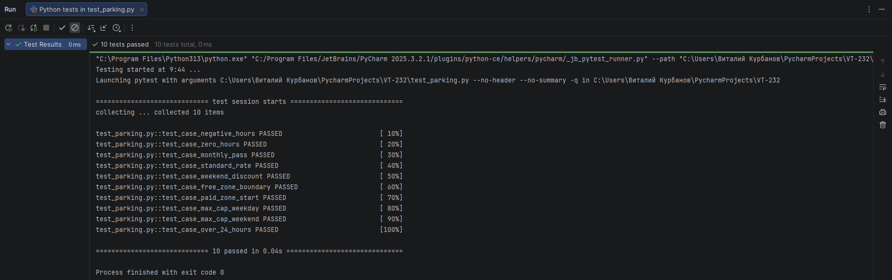

# Лабораторная работа №1 <br> Составление тест-кейсов для готового кода. Качество ПО и место тестирования в жизненном цикле

## Цель работы

Сформировать системное представление о качестве ПО и роли тестирования в жизненном цикле; приобрести практические навыки
проектирования тест-кейсов и написания автотестов на основе готового кода.

**Задачи:**

1. Проанализировать готовый модуль и выделить бизнес-правила, входные и выходные данные, ограничения.
2. Составить набор тест-кейсов: позитивных, негативных, граничных, покрывающих эквивалентные классы.
3. Оформить тест-кейсы по стандартным атрибутам.
4. Реализовать автотесты на Python + pytest.
5. Запустить тесты и зафиксировать результаты.
6. Сделать вывод о связи тестирования, качества ПО и жизненного цикла.

#### Задание 1: Изучить исходный код и выписать все бизнес-правила.

1. Если hours <= 0 — Ошибка.
2. Если has_pass == True — парковка бесплатна.
3. Первые 2 часа бесплатны.
4. Каждый следующий час стоит 50 рублей.
5. Если is_weekend == True, применяется скидка 20% на итоговую сумму.
6. Максимальная стоимость за сутки не может превышать 1000 рублей.

#### Задание 2: Определить: входные параметры, выходной параметр, допустимые и недопустимые значения, граничные значения.

##### Входные параметры:

1. hours - время в часах.
2. is_weekend - выходной день.
3. has_pass - наличие абонемента.

##### Выходной параметр:

* cost - итоговая стоимость

##### Допустимые и недопустимые значения:

Допустимые значения: 

1. hours > 0
2. is_weekend == True | is_weekend == False
3. has_pass == True | has_pass == False

Недопустимые значения:

1. hours <= 0

##### Граничные значения:

1. hours: [1, 2] - бесплатная зона
2. hours: [3, 24] - платная зона
3. hours: 1 - минимальное время
4. hours: 24 - максимальное время

#### Задание 3: Составить не менее 10 тест-кейсов.

### Таблица тест-кейсов для модуля расчета стоимости парковки

| ID    | Название тест-кейса           | Тип        | Входные данные `(hours, is_weekend, has_pass)` | Ожидаемый результат |
|:------|:------------------------------|:-----------|:-----------------------------------------------|:--------------------|
| TC-01 | Отрицательное время           | Негативный | `(-1, False, False)`                           | `ValueError`        |                                           
| TC-02 | Нулевое время                 | Негативный | `(0, False, False)`                            | `ValueError`        |                                            
| TC-03 | Наличие абонемента            | Позитивный | `(10, False, True)`                            | `0.0`               |
| TC-04 | Граница бесплатного времени   | Граничный  | `(2, False, False)`                            | `0.0`               |                                         
| TC-05 | Начало платной зоны           | Граничный  | `(3, False, False)`                            | `50.0`              |                                  
| TC-06 | Стандартный тариф             | Позитивный | `(10, False, False)`                           | `400.0`             |                                     
| TC-07 | Тариф в выходной день         | Позитивный | `(10, True, False)`                            | `320.0`             |                            
| TC-08 | Максимальное время в будни    | Граничный  | `(24, False, False)`                           | `1000.0`            | 
| TC-09 | Максимальное время в выходные | Граничный  | `(24, True, False)`                            | `880.0`             | 
| TC-10 | Время свыше суток             | Позитивный | `(30, False, False)`                           | `1000.0`            | 

#### Задание 4: Написать автотесты на `pytest`

Исходный код находится в файле parking.py

```python
import pytest
from parking import calculate_parking_fee

def test_case_negative_hours():
    with pytest.raises(ValueError, match="hours must be > 0"):
        calculate_parking_fee(-1, False, False)

def test_case_zero_hours():
    with pytest.raises(ValueError):
        calculate_parking_fee(0, False, False)

def test_case_monthly_pass():
    assert calculate_parking_fee(10, False, True) == 0.0

def test_case_standard_rate():
    assert calculate_parking_fee(10, False, False) == 400.0

def test_case_weekend_discount():
    assert calculate_parking_fee(10, True, False) == 320.0

def test_case_free_zone_boundary():
    assert calculate_parking_fee(2, False, False) == 0.0

def test_case_paid_zone_start():
    assert calculate_parking_fee(3, False, False) == 50.0

def test_case_max_cap_weekday():
    assert calculate_parking_fee(24, False, False) == 1000.0

def test_case_max_cap_weekend():
    assert calculate_parking_fee(24, True, False) == 880.0

def test_case_over_24_hours():
    assert calculate_parking_fee(30, False, False) == 1000.0
```

#### Задание 5: Запустить тесты командой `pytest -v`:



#### Задание 6: Сделать вывод: какие ветви кода покрыты, какие риски остались, почему тестирование важно для качества.

* Какие ветви кода покрыты?

Покрыты пути валидации, ранний выход при наличии абонемента, условия расчета стоимости: бесплатная зона, платная
зона, применен коэффициент выходного дня, потолок цены.

* Какие риски остались?

Код не умеет считать многосуточную парковку, так как hours > 24 обрезается. Из-за этого если клиент оставит машину на 2
дня он заплатит 1000р.

Если на входе придет строка вместо числа, код упадет с ошибкой TypeError, а не ValueError.

Нет проверки на float, так как если передать 2.5, код посчитает (2.5 - 2) * 50 = 25 рублей, а не 3 часа как должно быть
с точки зрения бизнес логики.

* Почему тестирование важно для качества?

Чем раньше мы обнаружим проблему, тем дешевле обойдется ее исправление. Если мы найдем баг до влития релиза в прод, его
исправление будет гораздо дешевле, чем если бы нам пришлось выпускать hotfix или вливать блокеры позже.

Тесты хорошо служат как живая документация, прочитав которую, новый разработчик может понять как работает бизнес логика
несмотря на исходники.

Помимо этого написание тестов неизбежно приводит к уточнению требований и их доработки со стороны аналитиков.
